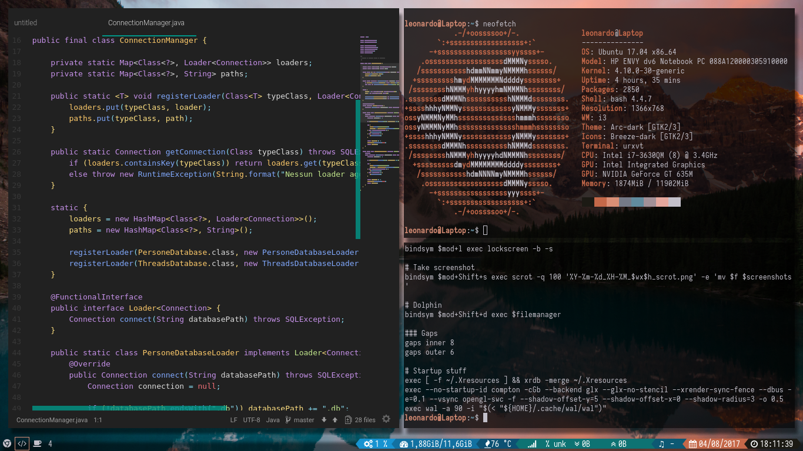
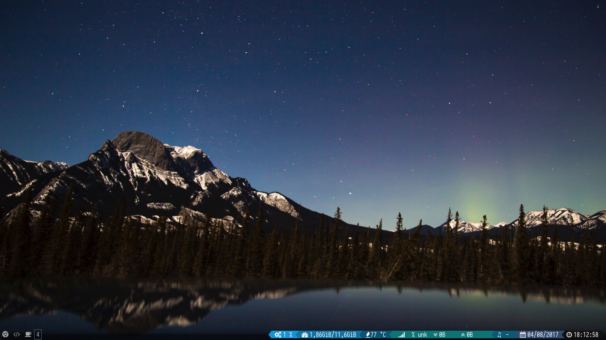
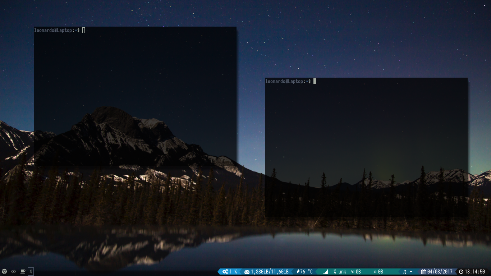
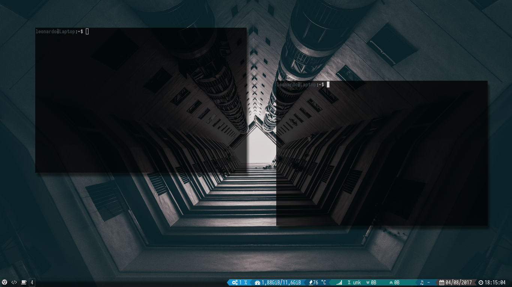

# Baldomo's dotfiles #
Welcome to my dotfiles repo :)

#### Dependencies ####
---
- [Wal](https://github.com/dylanaraps/wal)
- [i3-gaps](https://github.com/Airblader/i3) (duh)
- Font: [Iosevka](https://github.com/be5invis/Iosevka)
- [Rofi](https://davedavenport.github.io/rofi/)
- i3-lock (pretty locking script taken from [reddit/r/unixporn](https://reddit.com/r/unixporn))
- dmenu (i3-dmenu-desktop)
- Compton
- Conky
- Scrot
- *Bash* (Conky won't parse Xres colors as the conky-getcolors script uses bash's string separation, **giving an error**)

#### Suggestions ####
---
Place/link the lockscreen script in /bin so the i3 config can easily run it.
Scrot config (folder to save screenshots in) is at line 251 of [the i3 config](https://github.com/Baldomo/dotfiles/blob/master/i3/config)

#### Screenshots ####
---

---

##### Enjoy! #####